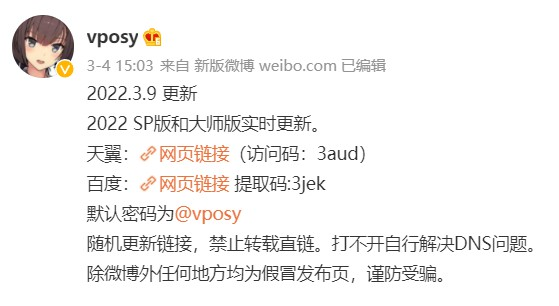

#  Adobe_Photoshop_2022 全家桶下载 最新2022版

Photoshop2022中文破解版是一款高效、专业、实用的图像处理软件,可以使工作更加简单,它拥有最强大的图片编辑能力。

总有一些国内、外的大神在破解Adobe全家桶软件w包括Windows、Mac系统最新版的2021、2022版PS、AI、PR、PL、ME、ID、AU、AE、AN等图形、视频、音频、特效编辑软件，并免费分享给大家使用。

之前介绍过Adobe GenP这款国外大神开发的破解Adobe的工具，目前依然有效，可完美激活官方下载的Photoshop 2022.

今年国内也出现了一位破解Adobe软件的高手，就是这位被大家称为大神的vposy。

### 一，vposy大神是谁？为什么敢破解？

没人知道他是谁，做这样的事情毕竟有风险。

vposy只通过新浪微博发布最新消息和进展，介绍中写着“互联网科技博主”，江苏常州。

目前我国打击盗版“剑网2021”专项行动还在继续，vposy敢破解Adobe的正版软件，而且公开高调分享，原因不外乎这两个：

1，vposy是一位超级高手，神龙见首不见尾，而且侠肝义胆、仗义分享。

2，vposy是Adobe的人，为了普及最新版全家桶软件，以便撒大网捞大鱼、碰瓷销售。因为哪些人、哪些公司在用盗版Adobe软件，Adobe公司非常清楚，除非用户不连网。

### 二，vposy大神破解的Adobe全家桶在哪里下载，网盘链接、解压密码是什么？
vposy会在微博中公布分享链接，和破解的进度。
最新更新：

vposy的微博网址：https://weibo.com/vposy

默认解压密码为：@vposy

毕竟树大招风，如果暂时在微博中没找到链接，也可在这里下载，转存于vposy的百度网盘，并保持同步更新：

2022 SP版和大师版实时更新。

天翼：https://cloud.189.cn/web/share?code=J326ZrqEB7ru（访问码：3aud）

百度：https://pan.baidu.com/share/init?surl=cv6mg9ycFSinHnPoOzCgrA&pwd=3jek 提取码:3jek

默认密码为@vposy

Adobe全家桶软件目录、最新版本号（部分，即时更新）：

2022 Win x64 SP版：

Adobe_Photoshop_2022_23.2.0.277
Adobe_After_Effects_2022_22.2.0.120_ACR14.2
Adobe_Animate_2022_22.0.3.179_ACR14.2
Adobe_Premiere_Pro_2022_22.2.0.128
Adobe_Illustrator_2022_26.0.3.778
Adobe_Lightroom_Classic_11.2.0.202201281441
Adobe_Bridge_2022_12.0.1.246_ACR14.2
Adobe_Character_Animator_2022_22.2.0.62
Adobe_Media_Encoder_2022_22.2.0.64
Adobe_InDesign_2022_17.1.0.050
Adobe_Dreamweaver_2021_21.2.0.15523
Adobe_InCopy_2022_17.1.0.050
Adobe_Prelude_2022_22.1.1.2
Adobe_Audition_2022_22.2.0.61
Adobe_XD_47.1.22

2020 Win x64 大师版

CC 2019 Win x64 大师版

2021 Elements Win x64 简化版

2022 Elements Win x64 简化版

Adobe_PremiereElements_2022_20.0

Adobe_PhotoshopElements_2022_20.0

2021 Win x64 SP版

CC 2017 Win x64 SP版

2021 Win x64 大师版

MacOS Adobe全家桶 SP版本

Adobe_After_Effects_2021_18.4.1.4

Adobe_Photoshop_2021_22.4.2.242

Adobe_Substance_3D_Painter_7.2.0.1082

Adobe_Animate_2021_21.0.7.42652

Adobe_Premiere_Pro_2021_15.4.1.6

Adobe_Substance_3D_Stager_1.0.0.5070
Adobe_Illustrator_2021_25.4.1.498
Adobe_Lightroom_Classic_10.3.0.202105281559
Adobe_Dimension_3.4.3.4022
Adobe_InDesign_2021_16.4.0.054
Adobe_Bridge_2021_11.1.1.185
Adobe_Media_Encoder_2021_15.4.1.5
Adobe_InCopy_2021_16.4.0.054
Adobe_Character_Animator_2021_4.4.0.44
Adobe_Substance_3D_Designer_11.2.0.4786
Adobe_Dreamweaver_2021_21.1.0.15413
Adobe_Prelude_2021_10.0.0.34
Adobe_Substance_3D_Sampler_3.0.0.186
Adobe_Audition_2021_14.2.0.34
Adobe_XD_43.0.12_20210914.dmg
LuLu_2.2.0.dmg
CC 2018 Win x64 大师版
Substance
Adobe_Substance_3D_Painter_7.4.1.1418
Adobe_Substance_3D_Designer_11.3.3.5429
Adobe_Substance_3D_Sampler_3.2.0.1216
Adobe_Substance_3D_Stager_1.1.2.5207
CC 2018 Win x64 SP版
Acrobat SP版
Acrobat_DC_C_x32_2021.007.20102
Acrobat_DC_C_2020.013.20074
Acrobat_XI_11.0.23_Final
CS6 Win 大师版 Final
Captivate Win x64 SP版
Win7 x64 大师版 Final
Fresco Win x64 原版
CC 2019 Win x64 SP版
2020 Win x64 SP版

### 三，大师版和SP版是什么意思，有什么区别？

vposy分享的破解软件分为大师版和SP版，二者的区别是：

大师版：就是Adobe全家桶，所有软件合集，需要全部下载才能安装，可以只选择需要的某个软件来安装。

SP版：就是一个一个独立的软件安装文件，只选择需要的来下载安装就可以。

另外，vposy分享的下载链接内，还有以 .sha 为后缀的文件，这是用来验证下载的安装文件是否完整用的。

用记事本打开.sha扩展名的文件，里面只有一行乱码，这就是用来校验的MD5值。一般用不着，不用下载。如果安装文件有问题，重新下载就可以了。