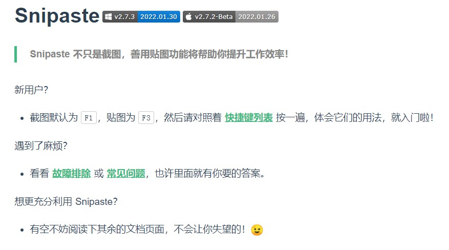

让 Snipaste 帮你提高工作效率
#### Snipaste 是一个简单但强大的截图工具
也可以让你将截图贴回到屏幕上！下载并打开 Snipaste，按下 F1 来开始截图，再按 F3，截图就在桌面置顶显示了。就这么简单！

#### 下载地址：https://zh.snipaste.com/

你还可以将剪贴板里的文字或者颜色信息转化为图片窗口，并且将它们进行缩放、旋转、翻转、设为半透明，甚至让鼠标能穿透它们！如果你是程序员、设计师，或者是大部分工作时间都在电脑前，贴图功能将改变你的工作方式、提升工作效率。

Snipaste 使用很简单，但同时也有一些较高级的用法可以进一步提升你的工作效率。感兴趣的话，请抽空读一读用户手册。

Snipaste 是免费软件，它也很安全，没有广告、不会扫描你的硬盘、更不会上传用户数据，它只做它应该做的事。
#### Snipaste

#### 基础操作
Snipaste 是一个简单但强大的贴图工具，同时也可以执行截屏、标注等功能。

#### 截屏
#### 开始截图
- 快捷键（默认为 F1）
- 鼠标左键 单击托盘图标
#### 何谓一次 成功的截图
-保存到剪贴板 (  / Ctrl + C / Enter / 双击 截屏区域)
-保存到文件 (  / Ctrl + S)
-保存到贴图 (  / Ctrl + T)
-快捷保存 (Shift +  / Ctrl + Shift + S)
#### 取消当前截图
- 任何时刻按 Esc
- 任何时刻点击工具条上的关闭按钮
- 非编辑状态下，按下鼠标右键
- 任何时刻有其他程序的窗口被激活
- 可在选项窗口关闭此行为
#### 回放截图记录
- 进入截图后，按 , 或 .
- 只有 成功的截图 才会出现在截图记录中
- 截图记录的最大数量，可在选项窗口中设置
- 逐像素控制光标移动