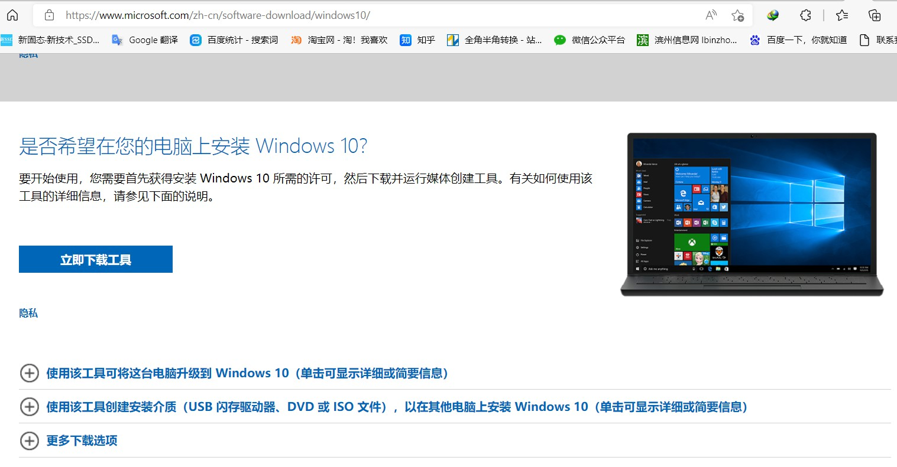

# windows10系统U盘制作方法

## 官方下载链接：
windows 10镜像：https://www.microsoft.com/zh-cn/software-download/windows10ISO/

## 安装盘制作视频方法
https://www.bilibili.com/video/BV1iL411P7KU/
<iframe src="//player.bilibili.com/player.html?aid=467320796&bvid=BV1iL411P7KU&cid=551040834&page=1" scrolling="no" width="800px" height="600px" border="0" frameborder="no" framespacing="0" allowfullscreen="true"> </iframe>

