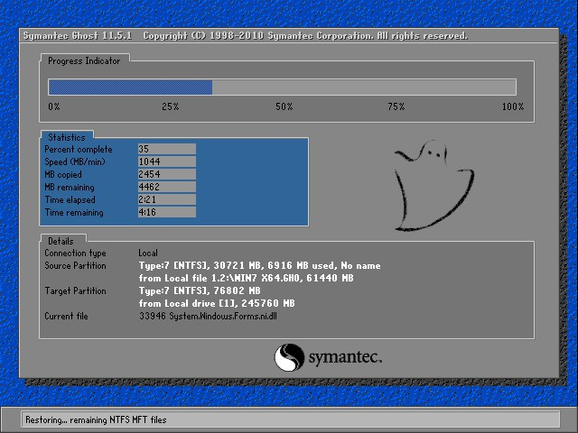
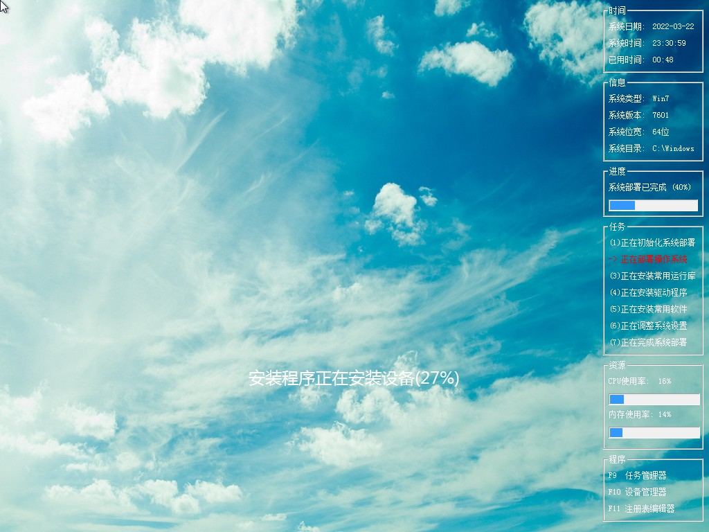

需要2个文件

1、GHOST安装器 http://soft.xinssd.com:89/?dl=3e77bf552c6d4174a2cc4c958aa97331

2、系统镜像文件 http://soft.xinssd.com:89/?dl=c34d0cc21218363a12b37ec8f212ce5f

重启出现下图这个画面就是成功了，一直等着就可以了，走完这一遍还得走一遍解压安装常用组件和驱动，中间不要断电，一直等着进入桌面就好了。
首次进桌面会安装一些常用的软件，有2345之类的一些，最后是安装OFFICE2007版，如果不需要这些软件，在第一次进桌面时重启一下电脑就行了。

重启后第一画面

再次重启释放系统画面

B站视频

<iframe src="//player.bilibili.com/player.html?aid=509967055&bvid=BV1ju411q7eC&cid=556335441&page=1" scrolling="no" width="800px" height="600px"  border="0" frameborder="no" framespacing="0" allowfullscreen="true"> </iframe>