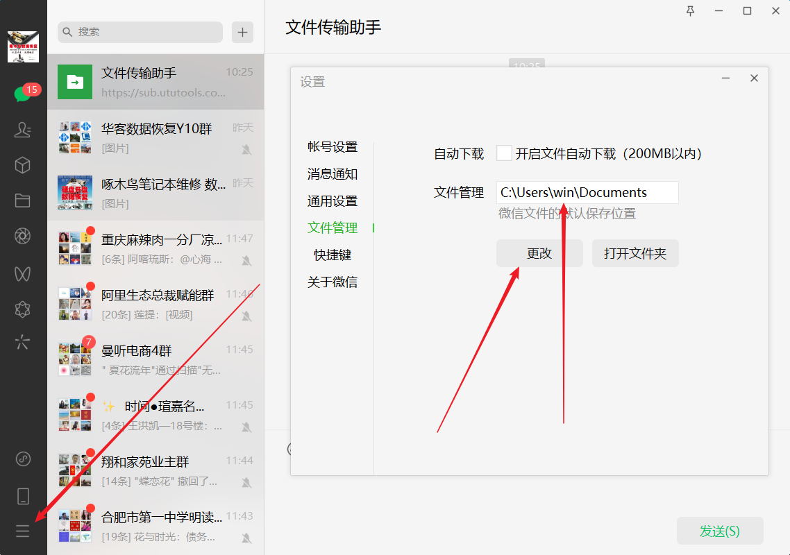

# QQ微信存储文件路径更改

C盘空间太满 大多是QQ和微信保存的文件太多，有的有十多G甚至几十G的也有，对于普通用户来说大多都没有什么用，可以删除。
先查看一下文件夹的大小，如果很大1G以上的，建议先把里面没有用的删掉，要不移起来很费时间，里面没有用的图片太多，数量太多，移动的话要很长时间的

# QQ存储的文件路径
- QQ文件存储路径：C:\Users\win(你的用户名)\Documents\Tencent Files
- 微信文件存储路径：C:\Users\win(你的用户名)\Documents\WeChat Files

#### 微信保存路径更改:

#### QQ保存路径更改

视频连接

<iframe src="//player.bilibili.com/player.html?aid=637418839&bvid=BV1kb4y1p7t4&cid=553913087&page=1" scrolling="no" width="800px" height="600px"  border="0" frameborder="no" framespacing="0" allowfullscreen="true"> </iframe>

## 常见故障