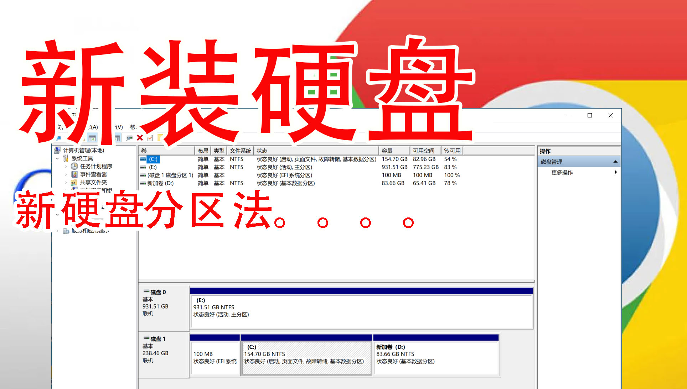

新安装的硬盘分区，用磁盘管理分区整理盘符

用“磁盘管理”给硬盘分区

B站视频连接
<iframe src="//player.bilibili.com/player.html?aid=679903431&bvid=BV1VS4y1g7Wv&cid=554100002&page=1" scrolling="no" width="800" height="600" border="0" frameborder="no" framespacing="0" allowfullscreen="true"> </iframe>