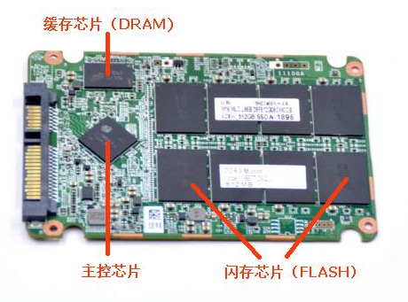

## 固态硬盘开卡维修常识性知识

  固态硬盘彻底坏了怎么办，比如不认盘、无法分区、无法格式化、读写蓝屏死机无响应等等比较严重的故障，这时候该怎么办呢？难道只能扔掉重新买一个吗？实际上是完全可以自己修好的，使用工厂级量产开卡工具，完全可以修复固态硬盘90%以上的故障问题。

### 简要步骤：
- 1、拆开固态硬盘；
- 2、查看主控、缓存、闪存芯片型号；
- 3、找到ROM跳线；
- 4、查找跟主控对应的开卡工具；
- 5、运行开卡软件，开卡修复。

 

 

### 一、首先要拆开固态硬盘，确定固态硬盘的主控型号、缓存型号和闪存型号

根据主控型号去寻找适合的开卡维修软件，如下图所示：

1、主控芯片：固态硬盘的控制芯片。不同的主控，对应不同的开卡修复软件。

2、缓存芯片：DRAM内存芯片，是给主控芯片提供缓存的芯片。

3、闪存芯片：FLASH闪存芯片、闪存颗粒，是固态硬盘存储数据的芯片。

例如上图，主控型号是SMI（慧荣）的SM2246EN，缓存型号是MICRON（美光），闪存型号也是MICRON（美光），那么维修时就需要去找SMI系列的SM2246EN主控开卡量产工具。

注意：同一种主控的量产工具版本很多，一般先用最新版本尝试开卡维修。但是量产软件版本也不是越新越好，个别闪存型号比较老，只有老一点的量产软件才能够支持。

 ### 二、其次需要找到固态硬盘ROM跳线
 让有故障的固态硬盘进入工程模式：

现在市场上慧荣SMI主控的SSD最多，下面就以慧荣SM2246XT主控固态硬盘的短接位置为例给大家说说。

如上图就是一个拆开的慧荣主控的固态硬盘，那么短接哪里呢？注意看上图板子上有一个ROM  MODE的标识，字母的边上的两个洞就是进入工程模式的短接位置，短接后再插入电脑，开卡软件就能识别你的SSD了。

注意：

1、其他固态硬盘的短接位置其实都差不多，基本都是有ROM、JP1这样的字母标识（另外，JMF主控一般是J1；英特尔、威刚很多型号是J3），实在找不到的，可以百度搜索一下。

2、电脑识别到新设备后，就可以取下短接跳线了，开卡过程中不要短接，否则会导致开卡失败。

3、尽量不要使用机箱前置USB接口开卡，更不要使用USB HUB、USB延长线之类的东西，把开卡板直接插到电脑机箱后面的USB接口开卡更稳定，可以有效防止因供电不足等原因而导致的开卡失败。

### 三、关于开卡板的说明

1、固态硬盘开卡需要使用USB转接板连接电脑，推荐购买专用开卡板。使用那些未经验证的普通硬盘盒开卡，经常会碰到一些千奇百怪的错误而导致开卡失败，专用开卡板可以让你少走很多弯路。

   注意：很多普通硬盘盒，包括JM20329E，仅仅支持二次开卡，不要买。（所谓二次开卡，就是不支持工程模式开卡，只有固态盘工作正常的时候，才能成功开卡）。

2、已经经过长期验证的开卡板系列如下：

(1) JM20329C/D专用开卡板：可以在Windows中开JMF系列主控、SMI系列主控、Maxiotek MK8115主控、MAS90x主控、Marvell 88nv1120主控；

(2) ASMT2105专用开卡板：可以在Linux虚拟机中开SF2000系列主控（必须工作在USB2.0模式）、在Windows中开SMI系列主控、PHISON PS3111主控、initio INIC6081主控、ASolid AS2258主控、Marvell 88nv1120主控；

(3) INIC-1608L开卡板可以在Linux虚拟机中开SF2000系列主控、在Windows中开SMI系列主控

(4) INIC-1618L开卡板可以在Linux虚拟机中开SF2000系列主控；

3、(1) mSATA接口固态开卡需要mSATA转SATA转接板；

(2) M.2 NGFF接口需要M.2 NGFF转SATA转接板；

(3) NVME接口需要NVME转USB转接盒（经验证，JMS583芯片可用）。

4、三星（SAMSUNG）全部主控、美满（Marvell）大部分主控到目前为止不能开卡（只有授权工厂才有工具），但是有部分故障通过安全擦除就可以成功修复。

5、群联（PHISON）主控（包括部分东芝主控，其实就是穿了马甲的群联主控）现在也可以维修了，PS3111主控已经有开卡工具，其他型号通过合成固件，使用固件升级的方式初始化磁盘，可以获得和开卡修复差不多的效果，只是目前局限性比较大，必须有可用的固件、必须在G41 LGA775平台（兼容性最好）上操作、新增坏块无法有效屏蔽等等。

### 开卡成功后的各项检查和测试
1、固态硬盘的分区格式化，推荐使用Windows自带的“磁盘管理”功能，也可以使用磁盘精灵DiskGenius（注意做好4K对齐），如下图：

2、固态硬盘的信息检测，使用CrystalDiskInfo，可以查看通电时间、通电次数、写入量等信息。如下图：

3、固态硬盘的速度测试，使用AS SSD Benchmark，如下图：

4、固态硬盘的稳定性和可靠性测试，使用urwtest_v18.exe做全盘读写校验，注意这个检测非常重要，属于开卡成功后必须进行的检验项目！如果全盘校验还是有坏块，就需要参考新增坏块重新开卡，或者使用RDT功能。